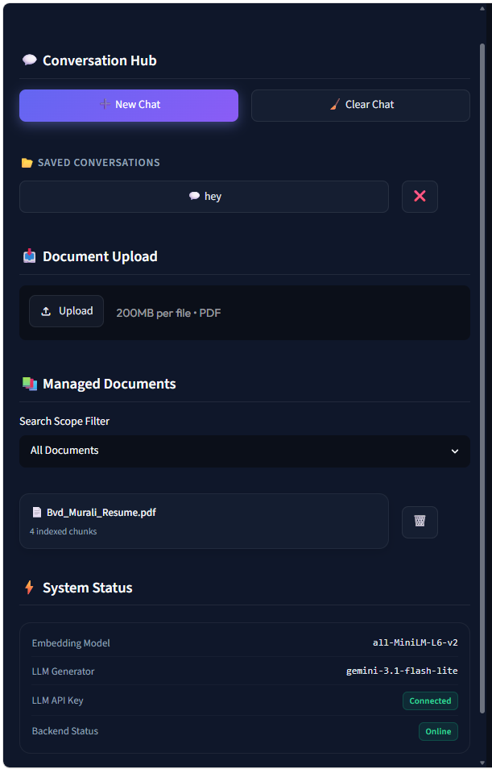
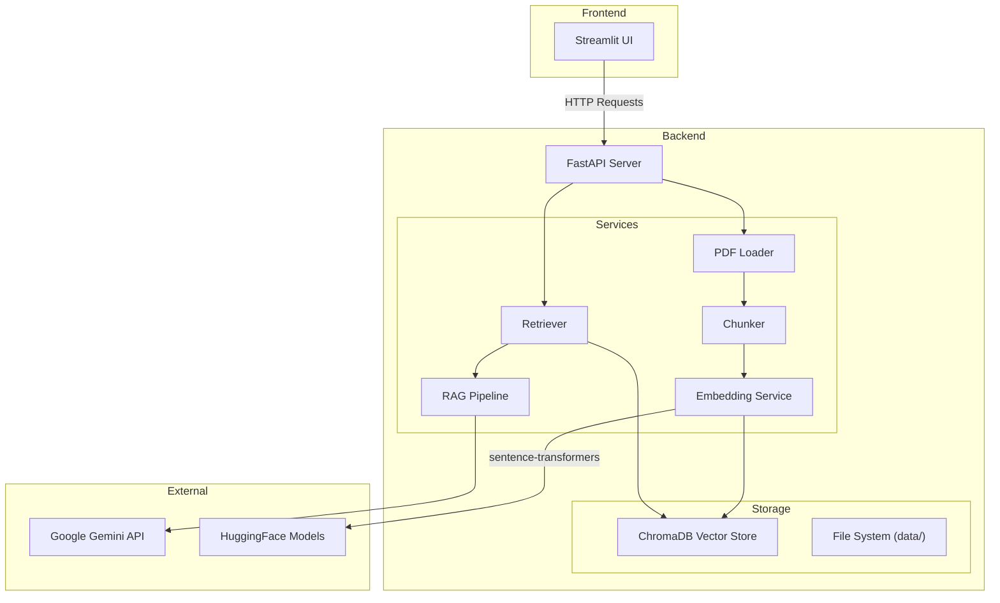

<div align="center">
  
</div>

# 🚀 Enterprise Retrieval-Augmented Generation (RAG) System

[](https://www.python.org/downloads/)
[](https://fastapi.tiangolo.com/)
[](https://streamlit.io/)
[](https://www.trychroma.com/)
[](https://python.langchain.com/)

A production-quality Enterprise RAG System built entirely from scratch using free and open-source tools. Upload PDFs, seamlessly index them in a local vector database, and chat with your documents using Google's Gemini LLM. The system enforces strict grounding, returning accurate answers backed by inline document citations and match percentages.

---

## ✨ Key Features

- **Semantic Search & Vector Indexing:** Fast, local semantic search using HuggingFace `sentence-transformers` and ChromaDB.
- **Strict Grounding:** The Gemini LLM is engineered to refuse answering questions that cannot be found in the uploaded context, ensuring zero hallucinations.
- **Inline Citations:** AI responses explicitly cite the source document name, page number, and provide a snippet of the retrieved text with a percentage match score.
- **Persistent Chat History:** Seamlessly switch between named, archived conversations. The app saves your progress completely locally.
- **Query Editing:** Made a typo? Click the "Edit Query" button to seamlessly replace your message and generate a fresh answer.
- **Premium Glassmorphic UI:** A beautifully designed frontend built with customized Streamlit CSS, featuring floating cards and vibrant gradients.

<div align="center">
  
</div>

---

## 🏗️ Architecture



---

## ⚡ Tech Stack

*   **Core Logic:** Python 3.11+
*   **LLM Orchestrator:** LangChain Express Language (LCEL)
*   **Vector Database:** ChromaDB (local persistence)
*   **Local Embeddings:** Sentence Transformers (`all-MiniLM-L6-v2`, 384 dimensions)
*   **Generative AI:** Google Gemini 3.1 Flash Lite
*   **API Framework:** FastAPI
*   **Frontend Interface:** Streamlit 
*   **Deployment:** Docker & Docker Compose

---

## 🚀 Getting Started

### 📋 Prerequisites
*   Python 3.11+
*   A Google Gemini API key (Free tier). Get one from [Google AI Studio](https://aistudio.google.com/apikey).

### 🔧 Local Installation

1.  **Clone the Repository:**
    ```bash
    git clone https://github.com/yourusername/enterprise-rag.git
    cd enterprise-rag
    ```

2.  **Create and Activate a Virtual Environment:**
    ```bash
    python -m venv venv
    # Windows:
    .\venv\Scripts\activate
    # Linux/macOS:
    source venv/bin/activate
    ```

3.  **Install Dependencies:**
    ```bash
    pip install -r requirements.txt
    ```

4.  **Configure Environment Variables:**
    Rename the `.env` template or create a new one in the root directory:
    ```ini
    GOOGLE_API_KEY=AIzaSyYourGeminiApiKeyHere...
    ```

5.  **Run the FastAPI Backend Server:**
    ```bash
    uvicorn backend.main:app --host 0.0.0.0 --port 8000 --reload
    ```
    *API Docs are available at: [http://localhost:8000/docs](http://localhost:8000/docs)*

6.  **Run the Streamlit Web UI:**
    Open a *new* terminal window, activate the virtual environment, and run:
    ```bash
    streamlit run frontend/streamlit_app.py
    ```
    *Open your browser at: [http://localhost:8501](http://localhost:8501)*

---

## 🐳 Running with Docker

Run the entire stack instantly using docker-compose. Volumes are pre-configured to ensure your uploaded PDFs and vector indexes persist on your local machine.

```bash
# Build and start the services in detached mode
docker-compose up --build -d

# Check the logs
docker-compose logs -f
```

---

## 🧪 Testing

A suite of unit and integration tests is located under the `tests/` directory to verify document parsing, chunking, database insertion, and API controllers.
```bash
pytest tests/ -v
```
