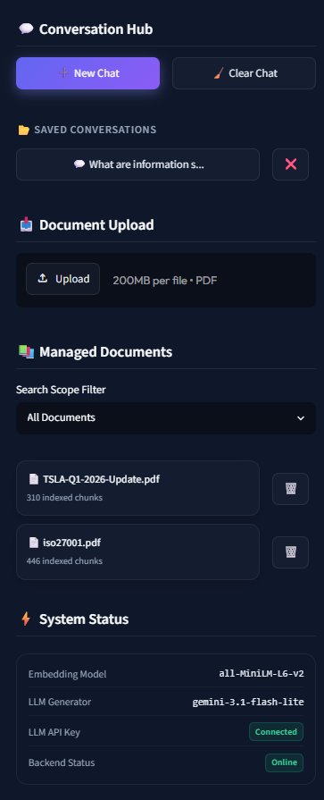
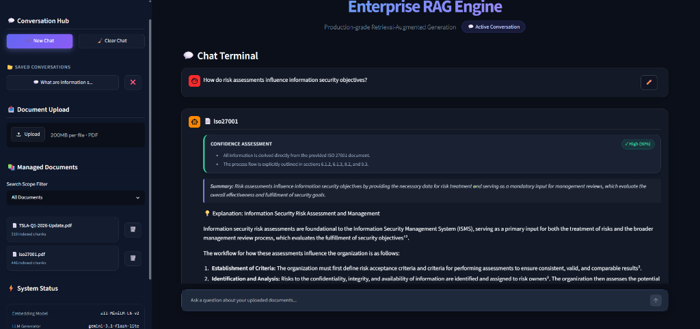
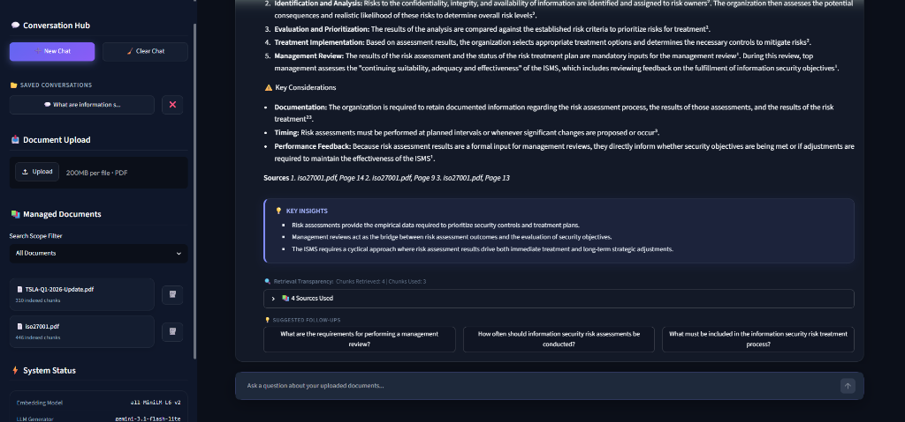
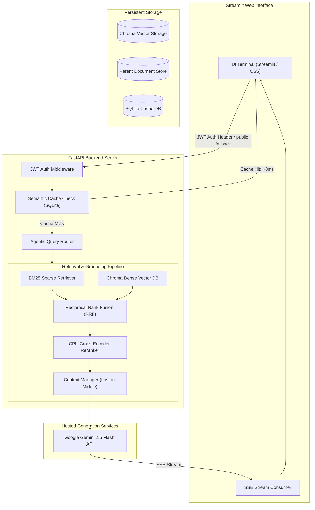
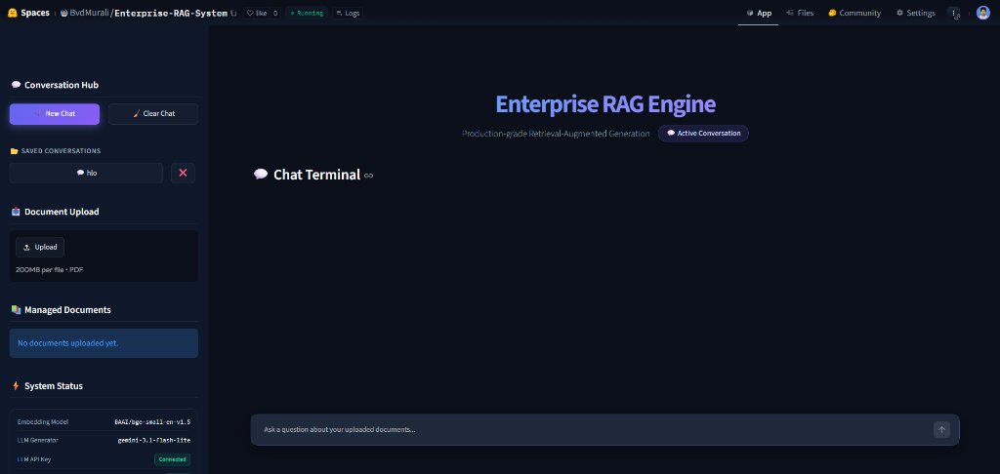

# 🚀 Enterprise Retrieval-Augmented Generation (RAG) Platform

[](https://www.python.org/downloads/)
[](https://fastapi.tiangolo.com/)
[](https://streamlit.io/)
[](https://www.trychroma.com/)
[](https://python.langchain.com/)
[](https://jwt.io/)

A production-grade, highly optimized Enterprise RAG (Retrieval-Augmented Generation) System engineered to deliver state-of-the-art retrieval accuracy, strict response grounding, and ultra-low latency. Specially architected for CPU-only corporate environments (optimized to run seamlessly on restricted infrastructure such as **Intel Core i5-6300U with 8 GB RAM**), the platform integrates hybrid retrieval, local neural re-ranking, triple-tier caching, and asynchronous Server-Sent Events (SSE) streaming to guarantee premium user experience under a strict **5-second Time-To-First-Token (TTFT) SLA**.

---

## 📸 System Interface & Visual Walkthrough

The platform features a modern, glassmorphic Streamlit interface designed for corporate analysts and administrators.

### 1. Unified Control Sidebar
<div align="center">
  
</div>

> [!NOTE]
> **Sidebar Functionality**:
> * **Conversation Hub**: Quick options to start a new chat or clear the active terminal session.
> * **Document Upload**: A secure file dropzone supporting multi-PDF ingestion up to 200MB per file with automatic role-based access group selection.
> * **Managed Documents**: Displays currently indexed PDFs and their precise child chunk counts, with a single-click trash icon to permanently remove documents from both the vector index and local storage.
> * **System Status**: Live diagnostics monitor, displaying the active local embedding model, LLM generator endpoint, Gemini API key validation state, and backend API status.

---

### 2. Conversational Terminal & Grounded Answers
<div align="center">
  
</div>

> [!TIP]
> **Response Interface Details**:
> * **Query Input**: Accepts natural language questions (e.g., *"How do risk assessments influence information security objectives?"*).
> * **Confidence Assessment**: Displays a real-time grounding verification pill (e.g., `🟢 High (90%)`) along with high-level validation facts directly extracted from source contexts.
> * **Executive Summary**: A concise one-sentence abstract of the answer for quick scanning.
> * **Grounded Explanation**: Detailed response incorporating superscript citations (e.g., `¹`, `²`) mapped exactly to the matching source documents.

---

### 3. Verification Details & Citation Transparency
<div align="center">
  
</div>

> [!IMPORTANT]
> **Verification Details**:
> * **Key Insights**: A structured card highlighting the primary takeaways of the generated response.
> * **Retrieval Transparency**: Displays telemetry metrics summarizing the number of raw child chunks retrieved versus the number of parent chunks cited in the response.
> * **Sources Drawer**: A collapsible drawer presenting the name, page numbers, relevance weights, and raw text of the underlying documents used to construct the answer.
> * **Suggested Follow-Ups**: Context-aware queries dynamically generated by the LLM based on the active conversation context.

---

## 🏗️ Production-Grade System Architecture

The following diagram illustrates the lifecycle of an user query as it navigates the system's security, caching, routing, hybrid search, neural re-ranking, and streaming generation layers:



---

## ⚙️ End-to-End Internal Workflows

### 1. Document Ingestion & Indexing Pipeline
The ingestion process utilizes a **Parent-Child Chunking Strategy** to solve the classic RAG dilemma: retrieving short, precise matching sentences while feeding broad context to the LLM.

```
[PDF Upload] ➔ [Text Extraction] ➔ [Parent Splits (~1KB)] ➔ [Child Splits (~200B)] ➔ [BGE Embeddings] ➔ [ChromaDB & File Store]
```

1. **API Upload**: The user posts a PDF to `/api/upload` along with an access control tag (e.g., `access_group="finance"`).
2. **Text Parsing**: `PDFLoaderService` extracts plaintext and page numbers.
3. **Parent Document Splitting**: The document is split into parent chunks of **1000 tokens** (overlap: **150 tokens**). Each parent is saved in a local key-value store (`LocalFileStore` mapped to `parent_store/`) under a unique `parent_id` UUID.
4. **Child Chunk Splitting**: Each parent chunk is further sub-divided into child chunks of **200 tokens** (overlap: **30 tokens**).
5. **Metadata Mapping**: Each child chunk is annotated with metadata:
   ```json
   {
     "parent_id": "uuid-v4-parent-id",
     "source": "iso27001.pdf",
     "page": 12,
     "access_group": "finance"
   }
   ```
6. **Vector Generation**: Child chunks are embedded using the local `BAAI/bge-small-en-v1.5` model (384 dimensions). Weights are loaded sequentially into RAM on CPU without memory-mapped overrides to prevent pagefile crashes.
7. **Storage Persistence**: Generated embeddings and metadata are stored in the `ChromaDB` collection. The local BM25 cache is invalidated to trigger a refit on the next query.

---

### 2. Dual-Retrieval & Re-ranking Workflow
To ensure high recall and precision, the retrieval layer executes a hybrid dense-sparse search, merges the candidates, and filters documents at the metadata level to enforce Role-Based Access Control (RBAC).

```
                 ┌── [ChromaDB Dense Search] ──┐
[User Query] ➔ ──┤                             ├──> [RRF Fusion] ➔ [Cross-Encoder Rerank] ➔ [Parent Context Fetch]
                 └── [BM25 Lexical Search] ────┘
```

1. **Access Filtering**: Active user roles are extracted from the incoming JWT token. A filter query is constructed:
   `{"access_group": {"$in": user_groups}}` (e.g. `{"access_group": {"$in": ["finance", "public"]}}`).
2. **Dense Vector Search**: ChromaDB performs a Cosine Similarity search on the embedding of the query, returning the top 15 child chunks matching the ACL filter.
3. **Sparse Lexical Search**: The custom BM25 index executes a keyword search on the query to find 15 matching child chunks. The server then filters these results to match the user's ACL.
4. **Reciprocal Rank Fusion (RRF)**: The dense and sparse results are merged to compute a unified rank score for each unique chunk:
   $$RRF\_Score(d) = \sum_{m \in \{dense, sparse\}} \frac{1}{\text{Rank}_m(d) + 60}$$
   The top 10 fused candidates are sent to the re-ranking layer.
5. **CPU-Optimized Neural Re-ranking**: The query and the fused text candidates (prepended with their document names for context matching) are passed to the `cross-encoder/ms-marco-MiniLM-L-6-v2` re-ranking model. The model computes a logit score representing the passage's relevance to the question.
6. **Parent Context Mapping**: The system takes the top $K$ (configured via `RETRIEVAL_TOP_K`) re-ranked child chunks. For each child, it queries `LocalFileStore` to fetch the full 1000-token parent chunk. This resolves chunk boundary fragmentation.
7. **Lost-in-the-Middle Layout**: The parent chunks are distributed such that the highest-scoring documents are placed at the beginning and the end of the prompt context, while lower-scoring documents are placed in the middle. This mitigates the LLM's tendency to ignore information in the middle of long prompts.

---

### 3. Generation, Grounding & Citation Processing

```
[Context Prompt] ➔ [Query Rewrite] ➔ [Gemini Inference] ➔ [Structured Parsing] ➔ [Citations Formatter] ➔ [Confidence Calculation]
```

1. **Query Rewriting**: If chat history is present, the pipeline rewrites the query into a standalone search query.
2. **Intent-Aware Prompting**: The system maps the query to one of eight intents (e.g., *definition, summary, comparison*) and injects custom prompt constraints to align the LLM's generation style.
3. **Inference with Structured XML**: The prompt and context (wrapped inside `<Document ID=X Source=Y Page=Z>...</Document>` XML tags) are sent to Gemini. The LLM is instructed to output the answer alongside specific metadata tags.
4. **Structured Tag Parsing**: The server extracts response content from the LLM's raw output tags:
   - `[ANSWER]`: The main response text.
   - `[SUMMARY]`: A short summary sentence.
   - `[CONFIDENCE_GROUNDING_SCORE]`: The LLM's self-assessed grounding percentage (e.g., `90%`).
   - `[KEY_INSIGHTS]`: Primary bullet points.
   - `[FOLLOWUPS]`: Relevant follow-up questions.
5. **Superscript Citations Formatting**: The citations formatter searches the answer text for brackets (e.g., `[Doc X, Page Y]`), matches them to the retrieved document array, converts them to superscript numbers (e.g., `¹`, `²`), and compiles a clean, numbered bibliography list at the bottom.
6. **Formulaic Confidence Score Calculation**: A mathematical formula computes the final confidence score by combining vector retrieval, neural re-ranking, LLM grounding self-evaluation, and citation density:
   $$\text{Confidence} = \frac{S_{\text{retrieval}} + S_{\text{reranker}} + S_{\text{citations}} + S_{\text{grounding}}}{4}$$
   *Where $S_{\text{reranker}}$ is sigmoid-scaled, and $S_{\text{citations}}$ is calculated as $\min(\text{citations} / 3.0, 1.0)$.*
7. **Semantic Cache Ingestion**: The query embedding, structured response, and cited sources are saved in `semantic_cache.db` for future reuse.

---

### 4. Client-Server Communication (FastAPI SSE Streaming)
To achieve an immediate perceived response time, the system streams tokens in real-time.

```
Client (Streamlit)              FastAPI Backend                SQLite Semantic Cache            Gemini API
      │                               │                                │                            │
      │ ── POST /api/ask/stream ────> │                                │                            │
      │                               │ ── Check cache similarity ───> │                            │
      │                               │ <── [HIT] Return cached data ──│                            │
      │ <── Stream Cached Chunks ──── │                                                             │
      │                               │ ─── [MISS] Fetch Context ────────────────────────────────> │
      │                               │ <────────────────────────────────── Stream Raw Tokens ───── │
      │ <── Stream Token Chunks ───── │                                                             │
      │ <── Stream Parsed Metadata ── │                                                             │
```

1. **Client Request**: The Streamlit frontend sends a `POST` request containing the question, chat history, and active document filters to `/api/ask/stream`.
2. **Authorization**: The request header contains the JWT token, which the FastAPI server validates to extract the user's role groups.
3. **Semantic Cache Lookup**: The backend checks `semantic_cache.db`. If a query embedding has a cosine distance of `< 0.08` to the current question, the server streams the cached response from memory in **~8ms**.
4. **Server-Sent Events (SSE) Stream**: On a cache miss, the server yields events sequentially:
   - `data: {"metadata": {"intent": "general"}}` - Streamlit adapts UI elements.
   - `data: {"sources": [...]}` - Streamlit renders sources.
   - `data: {"token": "..."}` - Streamlit displays text chunk-by-chunk in real time.
   - `data: {"parsed": {...}}` - Sends parsed insights, confidence reasons, follow-ups, and calculated scores.
5. **State Serialization**: After streaming completes, Streamlit calls `/api/conversations` to save the updated chat session to disk.

---

## 📂 Repository Structure

The active components of the workspace are organized as follows (obsolete screenshots, test databases, and virtual environments are ignored/removed):

```
enterprise-rag-system/
├── assets/                     # Media assets and screenshots
│   ├── rag_sidebar.png         # Sidebar controls & system status UI
│   ├── rag_chat_response.png   # Active chat terminal & grounded answer UI
│   └── rag_insights_sources.png# Key insights, sources & follow-ups UI
├── backend/                    # FastAPI Backend Application
│   ├── api/                    # API Routing and Schemas
│   │   ├── routes.py           # REST & Server-Sent Events (SSE) endpoints
│   │   └── schemas.py          # Pydantic request/response data models
│   ├── loaders/                # Document Parsing Modules
│   │   └── pdf_loader.py       # PDF reader and page metadata extractor
│   ├── models/                 # AI Model Integrations
│   │   └── llm.py              # Gemini client connector & API setup
│   ├── prompts/                # Prompt Templates
│   │   └── rag_prompt.py       # Heuristic intent prompt library
│   ├── services/               # Core Pipeline Services
│   │   ├── agentic_rag.py      # ReAct agent loop with self-reflection
│   │   ├── auth.py             # JWT token sign/verify & user registry
│   │   ├── embeddings.py       # Local BGE embeddings loader (sequential memory load)
│   │   ├── memory.py           # In-memory chat history manager
│   │   ├── rag_pipeline.py     # Main RAG workflow orchestrator
│   │   ├── retriever.py        # Hybrid retriever (BM25 + Chroma + RRF + Cross-Encoder)
│   │   └── semantic_cache.py   # Local SQLite semantic cache service
│   ├── vectorstore/            # Vector Database Connectors
│   │   └── chroma_store.py     # ChromaDB collection client wrapper
│   ├── config.py               # Pydantic base settings manager
│   ├── logger.py               # Central logger configuration
│   └── main.py                 # FastAPI application initializer & lifespan loader
├── frontend/                   # Streamlit Frontend Web App
│   └── streamlit_app.py        # Glassmorphic user interface & SSE listener
├── tests/                      # Pytest Suite & Quality Evaluations
│   ├── conftest.py             # Global fixtures (mocks & test databases)
│   ├── evaluate_rag.py         # LLM-as-a-Judge RAG evaluation pipeline
│   ├── test_api.py             # Route assertions & security check tests
│   ├── test_chunking.py        # Text splitting unit tests
│   ├── test_citations.py       # Footnotes formatting unit tests
│   ├── test_pdf_loader.py      # PDF text extractor tests
│   └── test_retriever.py       # Retrieval and RRF integration tests
├── .dockerignore               # Docker build exclude rules
├── .gitignore                  # Git untracked pattern registry
├── Dockerfile                  # Multi-stage container definition
├── docker-compose.yml          # Container orchestration profile
├── requirements.txt            # Python dependencies manifest
└── README.md                   # Platform documentation (This file)
```

---

## 💻 Tech Stack & Dependencies

* **Language**: Python 3.11+
* **Framework**: LangChain (LCEL) & LangGraph
* **Vector Store**: ChromaDB (with metadata grouping and parent document mappings)
* **Local Embedding**: `BAAI/bge-small-en-v1.5` (384 dimensions, 512 context limit, 134MB footprint)
* **Local Re-ranking**: `cross-encoder/ms-marco-MiniLM-L-6-v2` (80MB footprint)
* **Generative Service**: Google Gemini API (supporting `gemini-2.5-flash` and `gemini-3.1-flash-lite`)
* **API Framework**: FastAPI (Uvicorn HTTP server with Server-Sent Events)
* **Security & Auth**: Jose-JWT (Standalone JWT token parser and validator)
* **UI Interface**: Streamlit (styled with custom CSS overrides for glassmorphism)

---

## ⚡ CPU & Memory Tuning (OS Error 1455 Bypass)

Corporate servers and standard VMs with restricted paging files often crash when loading large PyTorch models (such as HuggingFace embedding weights or SentenceTransformer Cross-Encoders) with the error:
`OSError: [WinError 1455] The paging file is too small for this operation to complete`.

This error occurs because PyTorch's default loader utilizes memory-mapped file operations (`mmap` via `safetensors.safe_open`) to map model parameters directly into virtual memory address space. In systems with restricted page files, this allocation requests virtual address space that exceeds the OS configuration, even if there is enough physical RAM.

### How we solved it:
To bypass this issue, we configured the models to use standard sequential file reads instead of virtual memory mapping, loading weights directly into physical RAM:

1. **Local Embeddings Loading** ([embeddings.py](file:///c:/Users/Bvdmu/Enterprise%20RAG%20System/backend/services/embeddings.py)):
   We configured the underlying HuggingFace transformer arguments with `use_safetensors=False` to bypass memory mapping and force standard sequential reads into RAM.
2. **Reranker Loading** ([retriever.py](file:///c:/Users/Bvdmu/Enterprise%20RAG%20System/backend/services/retriever.py)):
   We configured the `CrossEncoder` constructor with `automodel_args={"use_safetensors": False}` to load weights sequentially without allocating excessive virtual memory space:
   ```python
   self.reranker = CrossEncoder(
       self.settings.reranker_model_name, 
       device="cpu",
       automodel_args={"use_safetensors": False}
   )
   ```

---

## 🚀 Getting Started

### 📋 Prerequisites
* Python 3.11+
* A Google Gemini API key from [Google AI Studio](https://aistudio.google.com/apikey).

### 🔧 Local Installation & Setup

1. **Clone & Navigate to the Directory**:
   ```bash
   git clone https://github.com/yourusername/enterprise-rag.git
   cd "enterprise-rag"
   ```

2. **Initialize and Activate Virtual Environment**:
   ```bash
   python -m venv venv
   # Windows:
   .\venv\Scripts\activate
   # Linux/macOS:
   source venv/bin/activate
   ```

3. **Install Dependencies**:
   ```bash
   pip install -r requirements.txt
   ```

4. **Configure Environment Variables**:
   Create a `.env` file in the root directory:
   ```ini
   GOOGLE_API_KEY=AIzaSyYourGeminiApiKeyHere...
   EMBEDDING_MODEL_NAME=BAAI/bge-small-en-v1.5
   RERANKER_MODEL_NAME=cross-encoder/ms-marco-MiniLM-L-6-v2
   CHROMA_PERSIST_DIR=./chroma_db
   CHROMA_COLLECTION_NAME=enterprise_rag
   PARENT_STORE_DIR=./parent_store
   SEMANTIC_CACHE_DB=./semantic_cache.db
   SEMANTIC_CACHE_THRESHOLD=0.08
   JWT_SECRET=your-local-jwt-secret-key
   JWT_ALGORITHM=HS256
   ```

5. **Start FastAPI Backend Server**:
   ```bash
   uvicorn backend.main:app --host 0.0.0.0 --port 8000 --reload
   ```
   *The interactive API documentation is available at [http://localhost:8000/docs](http://localhost:8000/docs).*

6. **Start Streamlit Web App**:
   ```bash
   streamlit run frontend/streamlit_app.py
   ```
   *The client web application is available at [http://localhost:8501](http://localhost:8501).*

---

## 🐳 Container Deployment

The system is fully containerized. To deploy the frontend and backend services in detached mode, run:

```bash
# Build and start services
docker-compose up --build -d

# View live container logs
docker-compose logs -f
```

---

## 🤗 Hugging Face Spaces Deployment (Docker Space)

You can host this entire platform completely for free on a Hugging Face Space using the Docker SDK, which provides a generous 16 GB of RAM on its free CPU tier.

### Live Deployment Preview

The following screenshot shows the Enterprise RAG Engine successfully deployed and running on Hugging Face Spaces at **[BvdMurali/Enterprise-RAG-System](https://huggingface.co/spaces/BvdMurali/Enterprise-RAG-System)**:

<div align="center">
  
</div>

> [!NOTE]
> The System Status panel confirms `BAAI/bge-small-en-v1.5` is loaded as the active embedding model, `gemini-3.1-flash-lite` is active as the primary LLM Generator, and the LLM API Key status is **Connected** — all via Hugging Face Secrets injection, without any `.env` file on disk.

---

### Step-by-Step Deployment Guide

#### Step 1: Create a new Hugging Face Space
- Go to [Hugging Face Spaces](https://huggingface.co/spaces) and click **Create new Space**.
- Set the Space name and select **Docker** as the SDK.
- Choose **Blank** (or standard template) and set the visibility to **Public** or **Private**.
- Select the free **CPU basic (16 GB RAM, 2 vCPU)** tier.

#### Step 2: Configure Secrets & Variables
Navigate to your Space's **Settings** > **Variables and Secrets** and add the following:

| Type | Name | Value | Required |
| :--- | :--- | :--- | :--- |
| 🔴 **Secret** | `GOOGLE_API_KEY` | Your Google Gemini API key from [AI Studio](https://aistudio.google.com/apikey) | ✅ Required |
| 🟡 **Variable** | `LLM_MODEL_NAME` | `gemini-3.1-flash-lite` | Recommended |

> [!IMPORTANT]
> The `GOOGLE_API_KEY` **must be added as a Secret** (not a plain variable) to keep it hidden from public view. Without it, the backend will start but all chat queries will fail.
> Set `LLM_MODEL_NAME=gemini-3.1-flash-lite` to use the optimal free-tier model (500 RPD vs. the default 20 RPD limit of `gemini-2.5-flash`).

#### Step 3: Clone the Space Repository and Upload Files
```bash
# 1. Clone the blank Space repository
git clone https://huggingface.co/spaces/BvdMurali/Enterprise-RAG-System
cd Enterprise-RAG-System

# 2. Copy project files (Windows Command Prompt)
xcopy /E /I /Y "..\Enterprise RAG System\backend" "backend"
xcopy /E /I /Y "..\Enterprise RAG System\frontend" "frontend"
xcopy /E /I /Y "..\Enterprise RAG System\.streamlit" ".streamlit"
copy "..\Enterprise RAG System\Dockerfile" "." /Y
copy "..\Enterprise RAG System\requirements.txt" "." /Y
copy "..\Enterprise RAG System\start.sh" "." /Y
copy "..\Enterprise RAG System\.dockerignore" "." /Y
copy "..\Enterprise RAG System\.gitignore" "." /Y

# 3. Commit and push
git add backend/ frontend/ .streamlit/ Dockerfile requirements.txt start.sh .dockerignore .gitignore
git commit -m "Deploy Enterprise RAG Platform to Hugging Face Spaces"
git push origin main
```
*When prompted, enter your Hugging Face username and paste your **Write Access Token** as the password (generate one at [huggingface.co/settings/tokens](https://huggingface.co/settings/tokens)).*

#### Step 4: Monitor the Build
Once pushed, navigate to the **App** tab of your Space. Hugging Face will automatically build the Docker image and start both services via `start.sh`. The build typically takes **5–8 minutes** on first run while downloading PyTorch model weights.

Your live application will be available at:
👉 **`https://huggingface.co/spaces/<your-username>/<your-space-name>`**

---

### Key Deployment Notes & Applied Fixes

| Issue | Root Cause | Fix Applied |
| :--- | :--- | :--- |
| **Build error: `.env` not found** | `.env` was never committed (by design) but Dockerfile tried to copy it | Removed `COPY .env` from `Dockerfile`; secrets are injected via HF Settings |
| **403 Forbidden on file upload** | HF embeds Streamlit in an iframe, blocking default XSRF protection | Added `enableCORS=false` and `enableXsrfProtection=false` to `.streamlit/config.toml` |
| **Upload error persisted after config fix** | `.streamlit/` folder was not copied into Docker image | Added `COPY .streamlit/ /app/.streamlit/` to `Dockerfile` |
| **`[Connection Error: timed out]`** | LangChain's Gemini client uses gRPC by default, which is blocked in HF containers | Added `transport="rest"` to all `ChatGoogleGenerativeAI` model instantiations |

> [!WARNING]
> **Data Persistence Warning**: Hugging Face Spaces use ephemeral storage on the free tier. Any PDF files you upload and index in ChromaDB will be wiped when the Space restarts or goes to sleep. For a persistent database, consider hosting on a VM (like Oracle Cloud Free Tier) or storing the index externally.

---

## 🧪 Testing & Evaluation

### 1. Run Automated Test Suite
Execute the test suite to verify the API, chunking, and search functionality:
```bash
# Activate virtualenv and run pytest
pytest
```

### 2. Run Quality Evaluations (LLM-as-a-Judge)
Execute the continuous quality evaluation script to measure retrieval-to-generation performance:
```bash
python tests/evaluate_rag.py
```
This script runs a test harness using Google Gemini to rate generated answers between `0.0` and `1.0` on two main metrics:
* **Faithfulness** (Target: `> 0.85`): Verifies if all assertions in the generated answer are strictly supported by the context without hallucinating details.
* **Answer Relevance** (Target: `> 0.80`): Verifies if the answer directly addresses the user's question.

---

## 📋 Performance & SLA Target

Designed specifically for restricted CPU corporate VMs, the platform aims to meet the following latency service level agreements (SLAs):

| SLA Tier | Time-To-First-Token (TTFT) | Status | Description |
| :--- | :--- | :--- | :--- |
| **Excellent** | `< 2.0 sec` | 🟢 Target | Cosine distance hit in SQLite Semantic Cache (latency ~8ms) or retrieval over short documents. |
| **Good** | `2.0 – 5.0 sec` | 🟡 Target | Standard generation performance with hybrid search, CPU cross-encoder re-ranking, and Gemini API inference. |
| **Acceptable** | `5.0 – 8.0 sec` | 🟠 Warning | Borderline latency; usually occurs during complex multi-page retrieval under high concurrent load. |
| **Poor** | `> 8.0 sec` | 🔴 Failed | Requires performance diagnostics and database cleanup. |

---

## 🔒 Standalone Security & Access Control (RBAC)

The system enforces document-level Role-Based Access Control (RBAC) without external OIDC dependencies:
1. **JWT Verification Service (`/api/auth/login`)**: The server signs access tokens containing user role groups (`user_groups`).
2. **Access Scopes**: PDFs can be tagged with access scopes during upload (e.g. `/api/upload?access_group=hr`).
3. **Vector Database ACL Filters**: The vector search queries automatically apply metadata filters (`$in` logical operators) to ensure users can only retrieve chunks they are authorized to view.
4. **Fallback Handling**: Requests without authorization headers default to the `"public"` access group, preventing unauthorized access.

---

## 🗺️ Product Roadmap

* [ ] **Dynamic Document Re-indexing**: Schedule automatic directory syncing to detect additions/deletions in real-time.
* [ ] **Local LLM Offline Integration**: Add fallback support to run offline generative inference via `Llama.cpp` or `Ollama` for air-gapped secure enterprise servers.
* [ ] **Visual PDF Highlights**: Implement interactive PDF coordinate mapping to highlight search context directly inside the document viewer on the UI.
