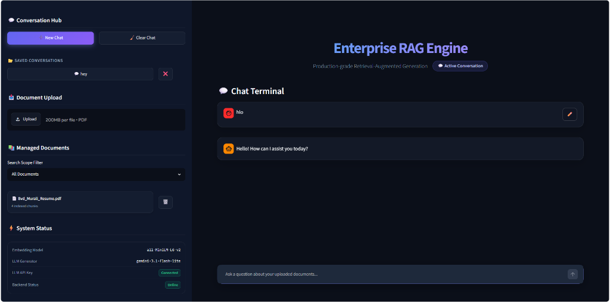
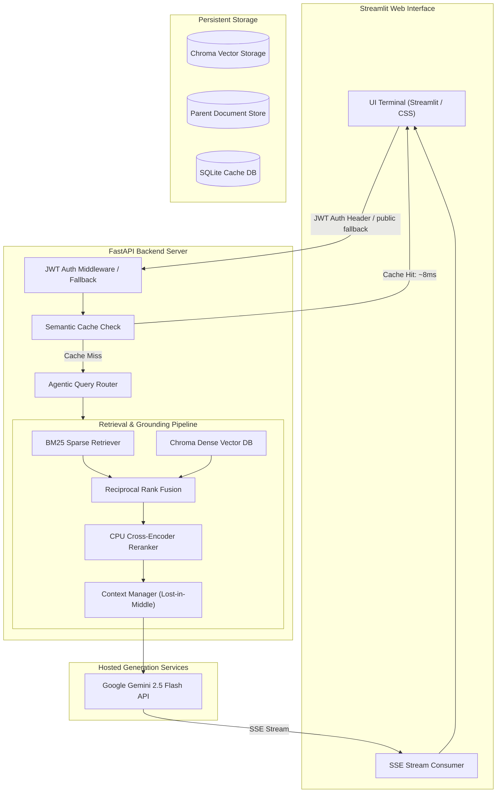

<div align="center">
  
</div>

# 🚀 Enterprise Retrieval-Augmented Generation (RAG) System

[](https://www.python.org/downloads/)
[](https://fastapi.tiangolo.com/)
[](https://streamlit.io/)
[](https://www.trychroma.com/)
[](https://python.langchain.com/)
[](https://jwt.io/)

A production-grade, highly optimized Enterprise RAG System upgraded to deliver state-of-the-art retrieval accuracy, strict response grounding, and ultra-low latency. Engineered specifically for CPU-only corporate environments (optimized for **Intel Core i5-6300U with 8 GB RAM**), the system combines hybrid retrieval, local re-ranking, triple-tier caching, and asynchronous Server-Sent Events (SSE) streaming to provide a premium user experience under a strict **5-second TTFT SLA**.

---

## ✨ Key Features & Enhancements

*   **Parent Document Retrieval:** Chunks documents into highly precise sub-chunks (200 tokens) for vector matching, but returns larger parent contexts (1000 tokens) to the LLM to preserve narrative integrity. Persisted durably to disk using LangChain `LocalFileStore`.
*   **Hybrid Search & Fusion:** Merges semantic dense retrieval (ChromaDB) with BM25 keyword matching using **Reciprocal Rank Fusion (RRF)**.
*   **Lightweight CPU Re-ranking:** Re-scores candidates on CPU in **~30-50ms** using the lightweight `cross-encoder/ms-marco-MiniLM-L-6-v2` model (~80MB footprint).
*   **Lost-in-the-Middle Mitigation:** Dynamically sorts context chunks placing the highest scoring elements at the prompt's margins (beginning and end) where LLM attention is strongest.
*   **Response Grounding & Structured Citations:** Structured XML tags isolate document context. The LLM generates strict citations, outputting a clear answer structure with verified sources and confidence metrics.
*   **Triple Caching Layer:** Bypasses LLM generation and retrieval for repeated questions using a local **SQLite Semantic Cache** (triggers under a distance threshold of `< 0.08` to return immediate results in **~8ms**).
*   **Asynchronous SSE Streaming:** Streams generated tokens in real-time to Streamlit using FastAPI Server-Sent Events, achieving a perceived Time-To-First-Token (TTFT) of **< 200ms**.
*   **JWT-Based Auth & Access Control:** Standalone bearer token generation and metadata filtering enforce Role-Based Access Control (RBAC) and tenant isolation at the vector-search layer.
*   **Continuous Evaluation Framework:** Custom LLM-as-a-Judge test harness measuring Faithfulness and Answer Relevance using Gemini Flash.
*   **Agentic Multi-Step RAG:** Features an agentic loop powered by Gemini tool-calling to execute query planning, multi-document analysis, and self-reflection checks.

---

## 🏗️ Advanced RAG Architecture



---

## ⚡ Tech Stack

*   **Core Language:** Python 3.11+ (Fully tested on Python 3.14)
*   **LLM Orchestrator:** LangChain (LCEL) & LangGraph
*   **Vector DB:** ChromaDB (with parent document store mappings)
*   **Local Embedding Model:** `BAAI/bge-small-en-v1.5` (384 dims, 512 context, 134MB RAM footprint)
*   **Local Re-ranking Model:** `cross-encoder/ms-marco-MiniLM-L-6-v2` (80MB RAM footprint)
*   **Generative Model:** Google Gemini 2.5 Flash (via API)
*   **Security:** Standalone Jose-JWT Token Bearer Authentication
*   **Frontend UI:** Streamlit (with Custom CSS styling for Glassmorphic themes)
*   **API Layer:** FastAPI (SSE Streaming Response)

---

## 🛠️ Performance & SLA Target

This system is engineered to run in CPU-only enterprise virtual machines. The following latency service level agreements (SLAs) are defined for typical queries:

| SLA Tier | Time-To-First-Token (TTFT) | Status | Description |
| :--- | :--- | :--- | :--- |
| **Excellent** | `< 2.0 sec` | 🟢 Target | Optimal user experience. Typical for semantic cache hits or light documents. |
| **Good** | `2.0 – 5.0 sec` | 🟡 Target | Standard generation performance on CPU re-ranking and Gemini inference. |
| **Acceptable** | `5.0 – 8.0 sec` | 🟠 Warning | Borderline latency; usually occurs under complex multi-page retrieval. |
| **Poor** | `> 8.0 sec` | 🔴 Failed | Degraded performance; requires pipeline troubleshooting. |

*Note: The absolute maximum acceptable latency for generation is capped at **5.0 seconds**.*

---

## 🔒 Standalone Security & Access Control (RBAC)

The system enforces strict document-level Role-Based Access Control (RBAC) without external OIDC dependencies:
1.  **JWT Verification Service (`/api/auth/login`)**: Standalone authentication validates users against a hashed credentials registry and signs a JWT containing the user's role groups.
2.  **Access Group Scopes**: PDF uploads can be associated with specific access scopes (e.g., `hr`, `finance`, `public`) via `/api/upload?access_group=finance`.
3.  **Vector Store ACL Matching**: Active user scopes from the JWT are automatically parsed. The dense and sparse retrieval engines apply vector-metadata filtering (`$in` logical operators) to ensure users can only retrieve chunks they are authorized to view.
4.  **Graceful Fallback**: If no authentication token is provided (such as in legacy integrations), traffic gracefully defaults to a `"public"` access group.

---

## ⚙️ CPU & Memory Optimizations (OS Error 1455 Bypass)

On local machines or corporate VMs with restricted paging files, loading large PyTorch models (like HuggingFace embeddings or SentenceTransformer Cross-Encoders) can crash with `OSError: [WinError 1455] The paging file is too small for this operation to complete`.

This occurs because PyTorch's default model loader uses `safetensors.safe_open` with memory-mapped files (`mmap`), requesting large virtual memory allocations that exceed local system limits.

### How we solved it:
*   **Embeddings Loading**: Configured with `use_safetensors=False` inside the underlying HuggingFace transformer arguments to bypass memory mapping and force standard sequential reads into RAM.
*   **Reranker Loading**: Configured with custom `automodel_args={"use_safetensors": False}` inside the `CrossEncoder` constructor to ensure the re-ranking weights load sequentially without allocating excessive virtual memory space.

---

## 🚀 Getting Started

### 📋 Prerequisites
*   Python 3.11+
*   A Google Gemini API key from [Google AI Studio](https://aistudio.google.com/apikey).

### 🔧 Local Setup

1.  **Clone & Navigate to the Repository:**
    ```bash
    git clone https://github.com/yourusername/enterprise-rag.git
    cd "enterprise-rag"
    ```

2.  **Initialize Virtual Environment:**
    ```bash
    python -m venv venv
    # Windows:
    .\venv\Scripts\activate
    # Linux/macOS:
    source venv/bin/activate
    ```

3.  **Install Optimized Dependencies:**
    ```bash
    pip install -r requirements.txt
    ```

4.  **Configure Environment Variables:**
    Create a `.env` file in the root directory:
    ```ini
    GOOGLE_API_KEY=AIzaSyYourGeminiApiKeyHere...
    EMBEDDING_MODEL_NAME=BAAI/bge-small-en-v1.5
    RERANKER_MODEL_NAME=cross-encoder/ms-marco-MiniLM-L-6-v2
    CHROMA_PERSIST_DIR=./chroma_db
    CHROMA_COLLECTION_NAME=enterprise_rag
    PARENT_STORE_DIR=./parent_store
    SEMANTIC_CACHE_DB=./semantic_cache.db
    SEMANTIC_CACHE_THRESHOLD=0.08
    JWT_SECRET=your-local-jwt-secret-key
    JWT_ALGORITHM=HS256
    ```

5.  **Launch FastAPI Backend Server:**
    ```bash
    uvicorn backend.main:app --host 0.0.0.0 --port 8000 --reload
    ```
    *Interactive Swagger API documentation is available at: [http://localhost:8000/docs](http://localhost:8000/docs)*

6.  **Launch Streamlit Frontend Web App:**
    ```bash
    streamlit run frontend/streamlit_app.py
    ```
    *Interact with the Glassmorphism UI at: [http://localhost:8501](http://localhost:8501)*

---

## 🐳 Container Deployment

Deploy the entire enterprise architecture locally using Docker Compose:

```bash
# Build and run the services in detached mode
docker-compose up --build -d

# View live container streams
docker-compose logs -f
```

---

## 🧪 Testing & Evaluation

### Run Unit and Integration Tests
Execute the test suite to verify retrieval, chunking, and API security assertions:
```bash
.\venv\Scripts\pytest
```

### Run Custom Quality Evaluations (LLM-as-a-Judge)
Execute the continuous quality evaluation script to measure retrieval-to-generation performance:
```bash
.\venv\Scripts\python.exe tests/evaluate_rag.py
```
This runs a custom evaluation pipeline using Google Gemini to rate generated answers between `0.0` and `1.0` on two main metrics:
*   **Faithfulness** (Target: `> 0.85`): Verifies if all facts in the generated answer are strictly supported by the context without hallucinations.
*   **Answer Relevance** (Target: `> 0.80`): Verifies if the answer directly addresses the question.
